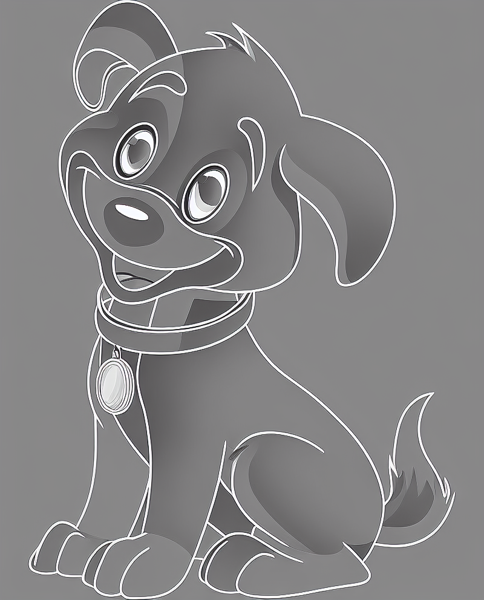

# Photo-to-Line-Art

This project implements a FastAPI application that converts input photos into line art using Stable Diffusion ControlNet, with a simple Streamlit web interface.

## ✨ Features

* Upload a photo (e.g. portrait, pet, object)
* Select edge detection model (`canny`, `depth`, `hed`)
* Customize thresholds and prompts
* Generate high-resolution line art ready for coloring or illustration

## 🖥️ Requirements

* Python 3.8+
* CUDA-enabled GPU (recommended for inference speed)
* pip or conda environment with required packages

## 🚀 Quick Start

### 1. Clone the repository

```bash
git clone https://github.com/your-repo/photo-to-line-art.git
cd photo-to-line-art
```

### 2. Set up environment

```bash
conda create -n line-art python=3.12 -y
conda activate line-art
pip install -r requirements.txt
```

### 3. Run the web app

```bash
streamlit run streamlit_app.py
```

The app will launch in your browser at `http://localhost:8501`

## 🛠️ Usage Instructions

* Upload an image in `.jpg`, `.jpeg`, or `.png` format
* Choose a ControlNet model:

  * `0` – Canny edge detector
  * `1` – Depth estimation
  * `2` – HED edge detector
* Adjust `low_threshold`, `high_threshold`, and prompt
* Click **Run** to generate the line art

## 📷 Example

**Input:**


**Output:**



## 📌 Notes

* The backend runs a FastAPI server that performs model inference.
* The frontend (Streamlit) automatically starts the FastAPI server if not running.
* Output images are named like `line_art_20250804_0001.png`.